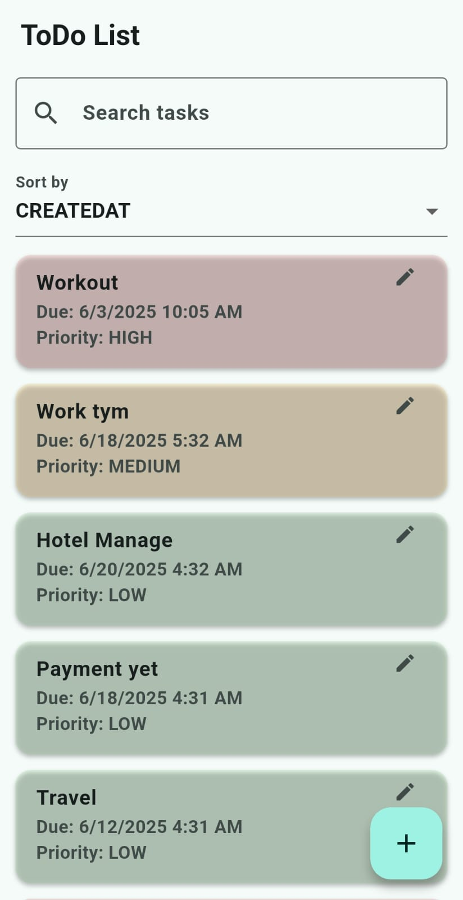
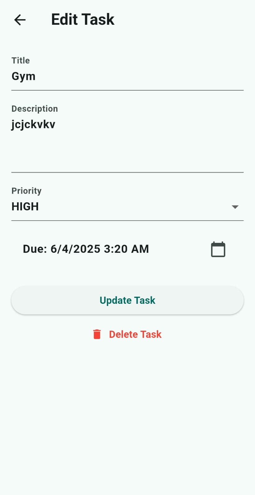
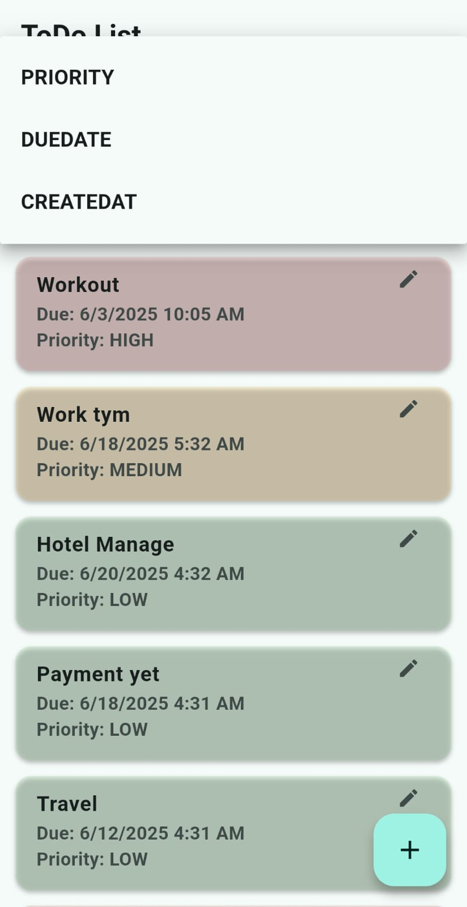
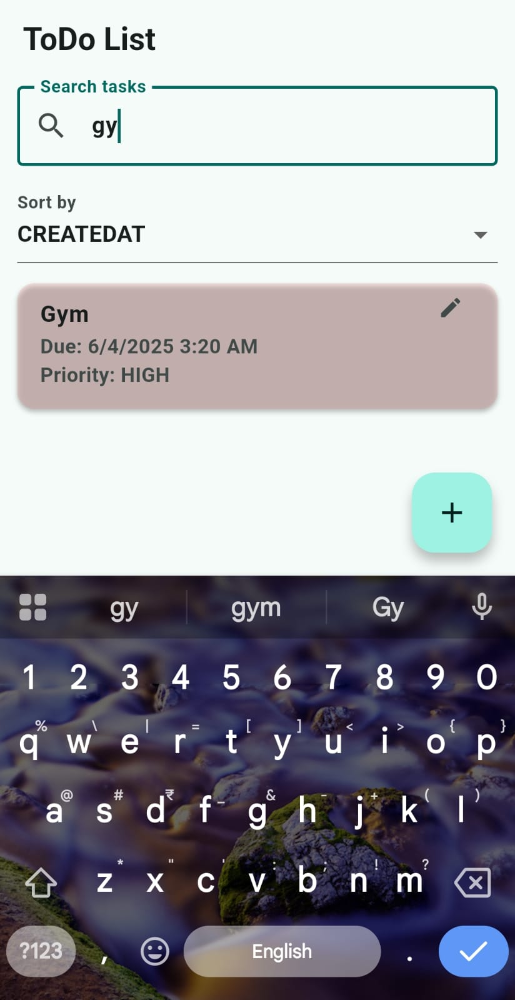

# 📋 ToDo List App (Flutter)

A clean and efficient Flutter ToDo List application featuring task creation, editing, deletion, priority sorting, keyword-based search, local data persistence using Hive, and local notifications for due reminders.

---

## 🚀 Features

- ✅ Add, edit, and delete tasks
- ⭐ Prioritize tasks (High, Medium, Low)
- 📅 Set due dates and receive reminders
- 🔍 Search tasks by title or description
- 🔃 Sort tasks by priority, due date, or creation date
- 💾 Persistent local storage with Hive
- 🔔 Push notifications before tasks are due

---

## 📷 Screenshots

| Home Screen | Add Task | Sort & Search | Notification |
|-------------|----------|---------------|--------------|
|  |  |  |  |

> ⚠️ Make sure the images are located in the `assets/screenshots/` folder in your project repo and update the filenames accordingly.

---

## 🛠️ Tech Stack

- **Flutter**
- **Hive** for local storage
- **flutter_local_notifications** for reminders
- **intl** for date formatting

---

## 🧠 Design Decisions

- Used simple `StatefulWidgets` instead of MVVM or GetX for simplicity and clarity
- Hive was chosen for its fast, lightweight, and no-SQL local database capability
- Notification triggers set 10 minutes before due time using `flutter_local_notifications`

---

## 🔧 Installation & Run Locally

1. Clone the repository:
   ```bash
   git clone https://github.com/your-username/todo_list_app.git
   cd todo_list_app
   ```

2. Get dependencies:
   ```bash
   flutter pub get
   ```

3. Run the app:
   ```bash
   flutter run
   ```

---

## 📄 License

This project is licensed under the MIT License.
